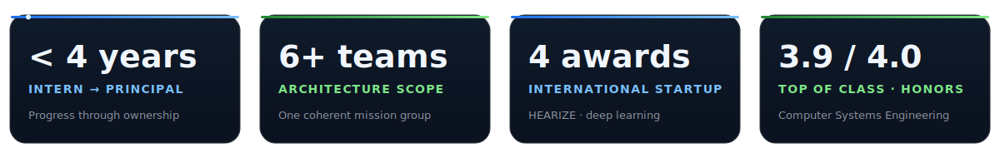

<div align="center">



### I turn architectural ambiguity into systems teams can trust.

Principal Software Engineer at **Foothill Technology Solutions × Restaurant365**<br>Backend Systems · Platform Architecture · Distributed Systems · Agentic AI

[](https://jihadabuzuhri.github.io/portfolio/) [](https://www.linkedin.com/in/jihadabuzuhri/) [](mailto:jihadabuzuhri@gmail.com)

[About](#get-about) · [Architecture](#get-architecture) · [Journey](#get-journey) · [Work](#get-work) · [Stack](#get-stack) · [Writing](#get-writing)

</div>



## `GET /about`

> I design the seams between teams and systems—service boundaries, data contracts, integration patterns, and the platform capabilities that let products evolve safely.

I'm **Jihad Abu Zuhri**, a Principal Software Engineer based in Nablus, Palestine 🇵🇸. I work across Restaurant365's multi-team engineering organization, reducing architectural ambiguity and keeping delivery technically coherent as systems and teams scale.

My path from backend intern to principal in under four years came from repeatedly choosing the uncomfortable problems: business-critical payroll workflows, cross-domain migration strategy, high-throughput performance investigations, and architecture decisions that need to outlive any single sprint.

```yaml
current_focus:
  - distributed backend and platform architecture
  - cross-team technical leadership
  - reliability, observability, and incident diagnostics
  - agentic AI and reusable engineering tooling
operating_principle: "Make the hard path clear, reusable, and observable."
```

## `GET /architecture`

<table>
  <tr>
    <td width="50%" valign="top">
      <h3>🏛️ Platform & integration</h3>
      <p>Provisioning and activation flows, API gateways, YARP reverse-proxy routing, authentication boundaries, and domain-safe contracts across services.</p>
      <p><code>System Design</code> <code>YARP</code> <code>Kubernetes</code> <code>APIs</code></p>
    </td>
    <td width="50%" valign="top">
      <h3>🧮 Event-driven platforms</h3>
      <p>Correct, traceable synchronization for business-critical payroll workflows, plus migration strategy and performance RCAs across six teams.</p>
      <p><code>.NET</code> <code>Event-Driven</code> <code>MediatR</code> <code>SQL Server</code></p>
    </td>
  </tr>
  <tr>
    <td width="50%" valign="top">
      <h3>📡 Reliability & observability</h3>
      <p>Distributed tracing, structured logging, query tuning, and investigation workflows that shorten the path from production alert to root cause.</p>
      <p><code>OpenTelemetry</code> <code>Elastic</code> <code>Kibana</code> <code>RCA</code></p>
    </td>
    <td width="50%" valign="top">
      <h3>🤖 Agentic engineering</h3>
      <p>AI agents and reusable engineering skills for investigation and diagnostics, alongside Kubernetes-hosted tooling that removes recurring team friction.</p>
      <p><code>Agentic AI</code> <code>ASP.NET Core 9</code> <code>Automation</code></p>
    </td>
  </tr>
</table>

## `GET /journey`

| When | Role | Scope |
| :-- | :-- | :-- |
| **May 2026 → now** | **Principal Software Engineer** | Technical lead for a six-team mission group; founded and run its weekly architecture council. |
| **Jul 2025 → May 2026** | **Senior Software Engineer — Payroll Platform** | Event-driven synchronization, migration strategy, performance RCAs, and cross-team architecture. |
| **Dec 2022 → Jul 2025** | **Backend Software Engineer** | Business-critical APIs and workflows across .NET/SQL Server and Spring Boot/PostgreSQL. |
| **Oct 2022 → Dec 2022** | **Backend Engineer — Intern** | C#, testing, APIs, data access, and system-design foundations. |

Alongside that journey, I co-founded **HEARIZE** and spent two years teaching programming, algorithms, and backend fundamentals at CSE Academy.

## `GET /work`

<table>
  <tr>
    <td width="50%" valign="top">
      <h3>🤟 <a href="https://jihadabuzuhri.github.io/portfolio/#projects">HEARIZE</a></h3>
      <p><strong>Giving sign language a voice.</strong></p>
      <p>Real-time, bidirectional sign-language ↔ speech translation using CNNs and computer vision, running on-device and in the cloud.</p>
      <p>🏆 IEEE Pioneer · Doc-Tech · GIC · IEEE Region 8</p>
    </td>
    <td width="50%" valign="top">
      <h3>🛰️ <a href="https://jihadabuzuhri.github.io/portfolio/">jihad.dev</a></h3>
      <p><strong>A portfolio that feels like software.</strong></p>
      <p>Hand-built with zero frameworks, templates, build steps, or runtime dependencies—featuring a command palette, working terminal, and canvas interactions.</p>
      <p><code>HTML</code> <code>CSS</code> <code>Vanilla JS</code> <code>Canvas</code></p>
    </td>
  </tr>
  <tr>
    <td width="50%" valign="top">
      <h3>🗂️ <a href="https://jihadabuzuhri.github.io/daily-dashboard/">Daily Dashboard</a></h3>
      <p><strong>A focused command center for the day.</strong></p>
      <p>An installable, offline-first PWA for tasks, journaling, bookmarks, focus sessions, and tag-driven workflows—with optional cross-device synchronization through a private GitHub gist.</p>
      <p><code>Vanilla JS</code> <code>Vite</code> <code>PWA</code> <code>Workbox</code></p>
      <p><a href="https://jihadabuzuhri.github.io/daily-dashboard/">Live site ↗</a> · <a href="https://github.com/jihadabuzuhri/daily-dashboard">Source ↗</a></p>
    </td>
    <td width="50%" valign="top">
      <h3>🎛️ <a href="https://jihadabuzuhri.github.io/modepilot-app/#top">ModePilot</a></h3>
      <p><strong>A personal Discord command center.</strong></p>
      <p>A local-only Rich Presence controller powered by private slash commands, configurable presets and expiration, persistent state, and Discord Desktop's documented local RPC—without using a self-bot.</p>
      <p><code>TypeScript</code> <code>Discord.js</code> <code>Local RPC</code> <code>Vitest</code></p>
      <p><a href="https://jihadabuzuhri.github.io/modepilot-app/#top">Live site ↗</a> · <a href="https://github.com/jihadabuzuhri/modepilot-app">Source ↗</a></p>
    </td>
  </tr>
</table>

## `GET /stack`

**Core stack**

      

**Architecture & platform**

      

<details>
<summary><strong>Open the full engineering toolbox</strong></summary>
<br>

| Area | Tools & practices |
| :-- | :-- |
| **Languages** | C#, Java, Python, JavaScript, SQL, C++, Bash |
| **Backend & APIs** | ASP.NET Core 9, Minimal APIs, Spring Boot, EF Core, JPA, REST, MediatR, Refit, JWT/OAuth2, xUnit/Moq |
| **Architecture** | DDD, event-driven systems, microservices, modular monoliths, API gateways, SOLID, distributed systems |
| **Data** | SQL Server, PostgreSQL, MongoDB, Oracle, Redis, schema design, indexing, query tuning, migrations |
| **Cloud & delivery** | Kubernetes, Helm, AKS, ArgoCD, Azure, AWS, Docker, GitHub/GitLab CI, Key Vault, Linux |
| **Observability** | OpenTelemetry, distributed tracing, Elasticsearch, Kibana, structured logging, metrics and alerting |
| **AI & ML** | Agentic AI systems, developer agents, TensorFlow, PyTorch, OpenCV, CNNs, on-device inference |

</details>

## `GET /writing`

I write down ideas that should compound beyond one conversation or one team.

- **[Refactoring in the AI Era: Code Smells Software Engineers Should Still Know](https://dev.to/jihadabuzuhri/refactoring-in-the-ai-era-code-smells-software-engineers-should-still-know-2ino)** — keeping generated and human-written code readable as AI changes the development loop.
- **[Understanding Rate Limiting: An Essential Guide for Developers](https://dev.to/jihadabuzuhri/understanding-rate-limiting-an-essential-guide-for-developers-2pa2)** — algorithms, trade-offs, and practical protection for APIs under load.

[](https://dev.to/jihadabuzuhri)

## `GET /beyond-code`

- 🎓 **B.Sc. Computer Systems Engineering**, Arab American University—top of class with honors, **3.9/4.0 GPA**.
- 🧭 Founded and run a weekly architecture council spanning six engineering teams.
- 👨‍🏫 Taught and mentored engineers for two years at CSE Academy.
- 🏅 Led university teams into **IEEEXtreme** and **ACM-ICPC**.
- 🌱 Founded developer communities at Arab American University.

<div align="center">

### `POST /contact` → `201 Created`

If you're working on a difficult backend, platform, or agentic-AI problem, I'd enjoy the conversation.

[](https://jihadabuzuhri.github.io/portfolio/) [](https://jihadabuzuhri.github.io/portfolio/resume.html) [](https://www.linkedin.com/in/jihadabuzuhri/)

<sub>Designed and maintained with intent—not generated from a profile template.</sub>

</div>
